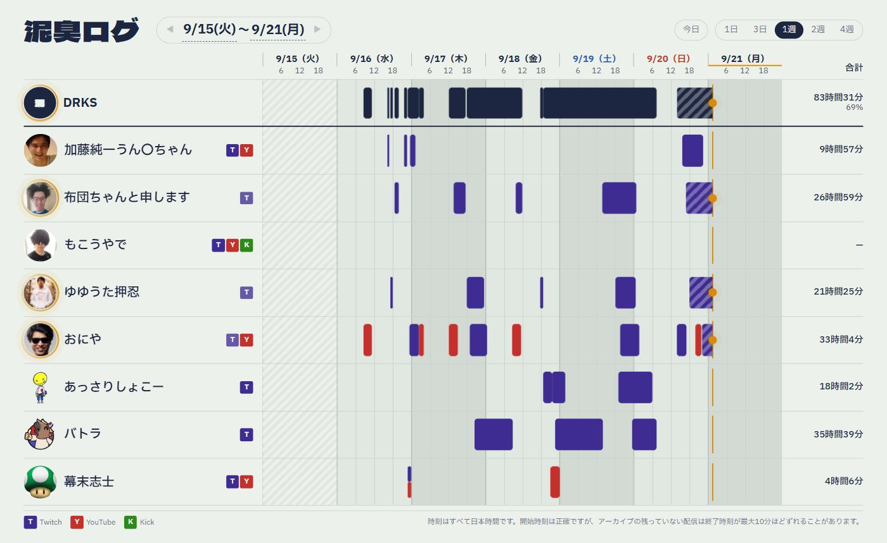

# 泥臭ログ

配信者チーム DRKS（8人）の配信実績を記録して、1枚のスケジュールボードで見るサイト。
「24時間、誰か1人は配信しているか」をひと目で確かめるために作った。

**https://kuronekorou39.github.io/DRKS-every-watching/**



## できること

- 1人1行で、Twitch（紫）/ YouTube（赤）/ Kick（緑）の配信を色分け。同時配信は上下に分けて表示
- いちばん上の **DRKS** 行は全員ぶんをまとめたもの。合計時間と、誰かが配信していた時間の割合が出る
- 表示範囲は 1日〜4週の切替、◀ ▶ での移動、日付を押してのカレンダー指定。範囲は URL（`?from=&to=`）に残る
- 配信中は、バーの縞とアイコンの輪が動く。バーを押すとサムネイル・タイトル・アーカイブへのリンクが出る
- スマホでも PC の全画面でも、スクロールなしで1画面に収まる

## しくみ

サーバーは持たない。GitHub Actions（`collect`）が10分おきに各 API から取得して `data` ブランチの
`history.json` に足し、変化があったときだけ GitHub Pages を再デプロイする。

| 配信先 | 取り方 | 過去の配信 |
|---|---|---|
| Twitch | アーカイブで正確な開始・終了を取り、ライブ状態のポーリングで補う | アーカイブが残っている分は初回に埋まる |
| YouTube | アップロード一覧の新しい50本から、ライブだったものの実際の時刻を取る | その50本に入っている分 |
| Kick | 配信中かどうかのポーリングだけ（公開 API に過去分がない） | 埋まらない。`manual.json` で足す |

- 一度記録した配信は、アーカイブが消えても残る（サムネイルは消える）
- `channels.json` の書き間違いでは、記録を書き換えずにエラーで止まる
- API の不調や Secrets の未設定では、そのプラットフォームだけ飛ばして前回までの記録を残す（Actions に警告が出る）

## 設定ファイル

**`channels.json`** … 記録するチャンネル。表示したい順に1人1件。配信しているものだけ書けばよい。

```json
[{ "name": "表示名（省略可）", "twitch": "ログイン名", "youtube": "@ハンドル か UC… の ID", "kick": "チャンネル名" }]
```

**`manual.json`** … API から取れない配信を手で足す。時刻は日本時間。`channel` は `channels.json` と同じ値。
このファイルが正なので、書き換えたり消したりすれば記録もそうなる（API から取った記録には影響しない）。

```json
[{ "platform": "kick", "channel": "mokoutoaruotoko", "start": "2026-09-01 21:00", "end": "2026-09-02 01:30", "title": "省略可" }]
```

**`settings.json`** … `recordFrom`（日本時間の日付）より前に始まった配信は記録しない。ボードでは斜線の「記録なし」になる。

```json
{ "recordFrom": "2026-09-16" }
```

どれも `main` に push すれば、すぐ取得とデプロイが走って反映される。

## セットアップ（自分のリポジトリで動かす場合）

1. リポジトリを **public** で作る（private だと10分おきの cron で Actions の無料枠を超える）
2. API の認証情報を用意して、リポジトリの Secrets に入れる（YouTube と Kick は使う場合だけ）

   | Secrets | 取得先 |
   |---|---|
   | `TWITCH_CLIENT_ID` / `TWITCH_CLIENT_SECRET` | https://dev.twitch.tv/console/apps でアプリ登録（リダイレクト URL は `http://localhost`、種類は「機密」） |
   | `YOUTUBE_API_KEY` | Google Cloud Console で「YouTube Data API v3」を有効にして API キーを作る |
   | `KICK_CLIENT_ID` / `KICK_CLIENT_SECRET` | https://kick.com/settings/developer でアプリを作る |

3. Settings → Pages → Source を「GitHub Actions」にする
4. `channels.json` を書き換えて push する（または Actions タブから `collect` を手動実行）

## ローカルで動かす

```powershell
npm run sample   # ダミーデータを data/history.json に作る
npm run serve    # http://localhost:8080
npm test         # 共通ロジックのテスト（Node 20.6 以上）

# 実データを取る場合は .env.example を .env にコピーして値を入れてから
npm run fetch
```

| 場所 | 中身 |
|---|---|
| `index.html` / `app.mjs` / `style.css` | 画面。ビルドなしの素の HTML・ES Modules・CSS |
| `lib/core.mjs` | 取得スクリプトと画面で共有するロジック（マージ、区間の結合、日時の整形） |
| `scripts/fetch.mjs` / `scripts/platforms/` | 取得。プラットフォームごとに1ファイル |
| `.github/workflows/collect.yml` | 10分おきの取得と Pages へのデプロイ |

## 注意

- 開始時刻は API の値なので正確。アーカイブが残らない配信は、終了時刻が最大10分ほどずれる
- YouTube はプレミア公開もライブとして拾うことがある（API で区別できない）
- Actions の cron は混雑時に遅れたりスキップされたりする
- リポジトリに60日間動きがないと定期実行は自動停止する。止まっていたら Actions タブから再有効化する
