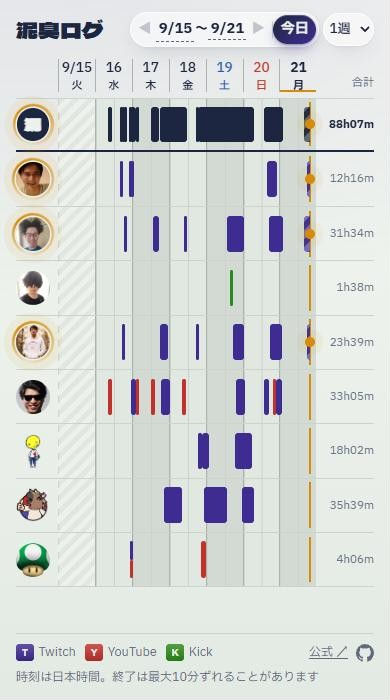

# 泥臭ログ

配信者チーム DRKS（8人）の配信実績を記録して、1枚のスケジュールボードで見るサイト。
「24時間、誰か1人は配信しているか」をひと目で確かめるために作った。

**https://kuronekorou39.github.io/DRKS-every-watching/** ・ DRKS の公式サイト: https://dorokusa.co.jp/

| PC | スマホ |
|---|---|
|  |  |

## できること

- 1人1行で、Twitch（紫）/ YouTube（赤）/ Kick（緑）の配信を色分け。同時配信は上下に分けて表示
- いちばん上の **DRKS** 行は全員ぶんをまとめたもの。誰か1人でも配信していた時間の合計が出る
- 表示範囲は 1日〜4週の切替、◀ ▶ での移動、日付を押してのカレンダー指定。範囲は URL（`?from=&to=`）に残る
- 配信中は、バーの縞とアイコンの輪が動く。バーを押すとサムネイル・タイトル・アーカイブへのリンクが出る
- スマホでも PC の全画面でも、スクロールなしで1画面に収まる

## しくみ（ひとことで）

サーバーは持たない。GitHub Actions が10分おきに Twitch / YouTube / Kick の API から取得して `data` ブランチに記録し、
GitHub Pages で公開する。一度記録した配信は、アーカイブが消えても残る。

## ドキュメント

- [しくみ](docs/how-it-works.md) … 取得と公開の流れ、配信先ごとの取り方、ファイルの構成、注意点
- [設定ファイル](docs/config.md) … 記録するチャンネル、手で足す配信（Kick の過去分の取り込み）、記録を残しはじめる日
- [セットアップ](docs/setup.md) … 自分のリポジトリで動かす手順、ローカルでの動かし方
